# 资料

> 官网：https://apisix.apache.org/zh/docs/apisix/getting-started/
>
> github源码：https://github.com/apache/apisix 主要基于lua语言写的

补充资料：

[openResty最佳实践](https://www.kancloud.cn/allanyu/openresty-best-practices/82668)

[Apache APISIX v3.2 中文文档](https://www.bookstack.cn/books/apisix-3.2-zh)

[apisix v2.5官方文档](https://www.bookstack.cn/read/apisix-2.5-zh/README.md)

[test:nginx 使用说明](https://blog.csdn.net/wuchunlai_2012/article/details/100059067)


# 0.基本介绍与使用

## apisix是什么？

Apache APISIX 是一个云原生、高性能、可扩展的微服务**API 开源网关**，

基于 Nginx/Openresty 网络库和 etcd 实现，

提供负载均衡、动态上游、灰度发布、服务熔断、身份认证、可观测性等**七层流量**管理功能，

可以用来处理网站、移动设备和 IoT 的流量，通常使用 Apache APISIX 来处理传统的南北向流量。与传统的API网关，具有动态路由、热插件加载、高性能等特点。

 

## 架构解析


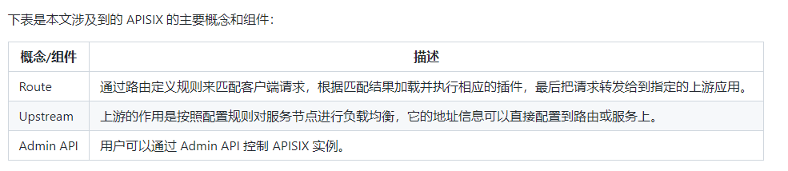

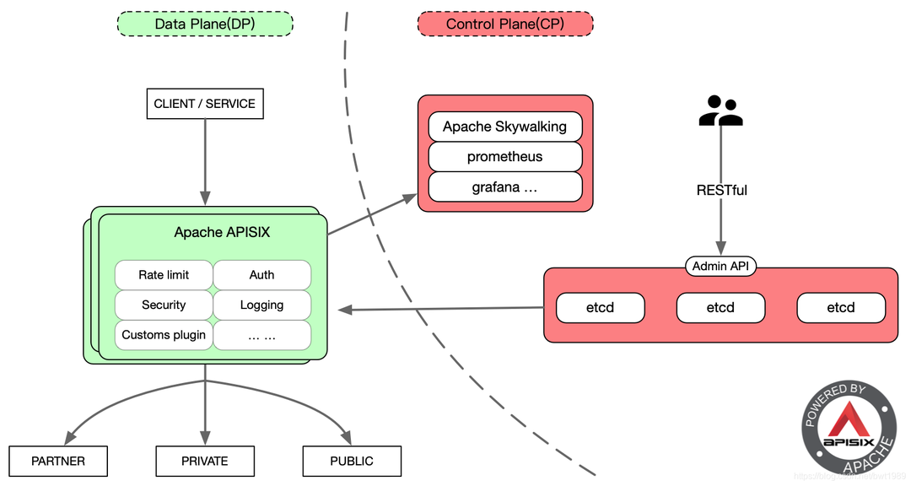


也分为数据平面和控制平面（Control Plane）

 

## 基本使用

dashboad主要配置两个部分，一个是**上游服务**，也就是上游的ip 端口相关的服务。

一个是**路由部分**，主要是配置路由转发、路由相关的插件以及该路由关联的上游服务。

### 创建上游服务

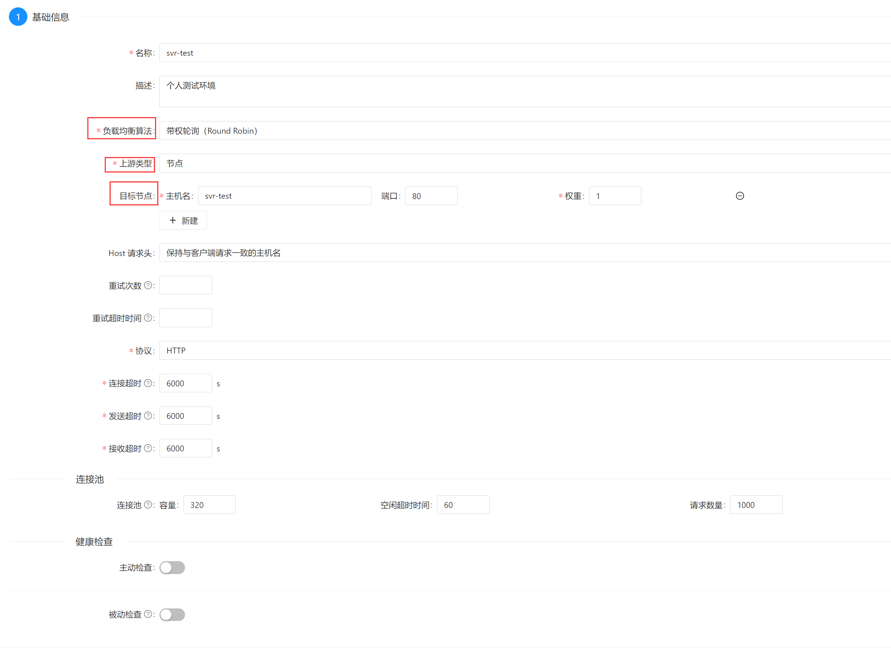

负载均衡算法：

- 一致性哈希CHash
- 带权轮询 Round Robin
- 指数加权移动平均 EWMA
- 最小连接数 least_conn


上游类型：包括ip端口（节点）模式 和 服务发现模式

 

其他设置默认即可：重试、超时、连接池、健康检查

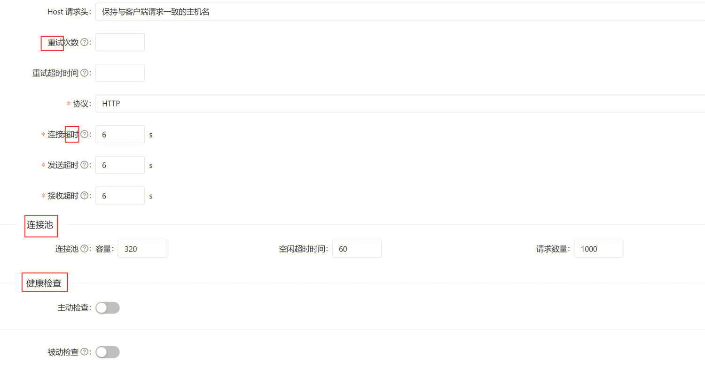


 

 

补充：

ps:主机名在k8s中填写service的name即可，在k8s集群中**同个命名空间**下的service可以根据name进行通信，ping得通：

```bash
[root@apisix-gw]# ping phpsvr-test
PING phpsvr-test.tgh.svc.cluster.local (9.xxx.xxx.xxx) 56(84) bytes of data.
64 bytes from phpsvr-test.tgh.svc.cluster.local (9.xxx.xxx.xxx): icmp_seq=1 ttl=64 time=0.049 ms
```

 

### 创建路由

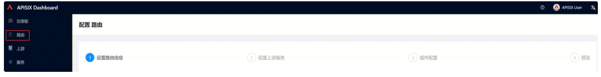

1、设置路由信息

主要设置匹配条件：

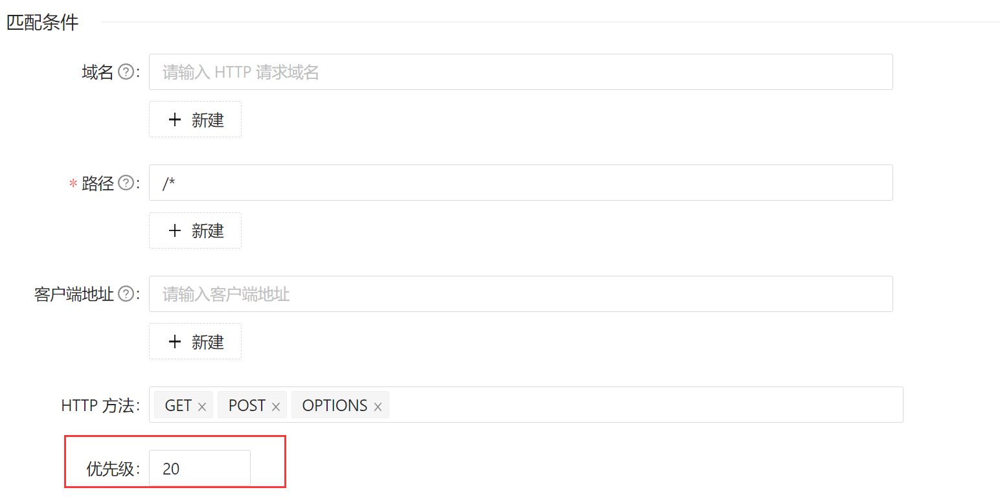

 

请求改写：

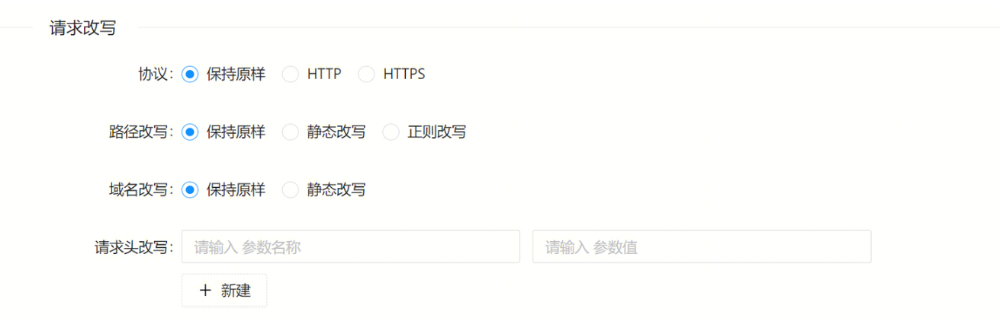


高级条件匹配：

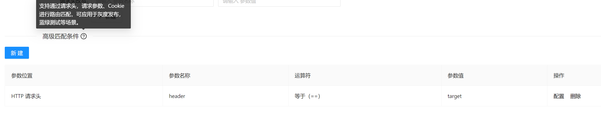


所有请求会先请求到apisix-gw网关，再进行转发，所以多个路由配置会冲突（默认是最长路径匹配），一般需要根据高级条件进行匹配。

 

 2、设置上游服务

可以重新手动填写，也可以直接关联已经创建的上游服务。

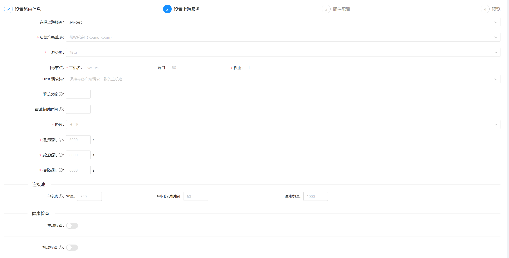

 （这里的信息与创建上游服务的配置一致）

3、插件配置

这里插件配置可以根据需要配置相应的插件，比如跨域插件、auth插件、mo监控插件等。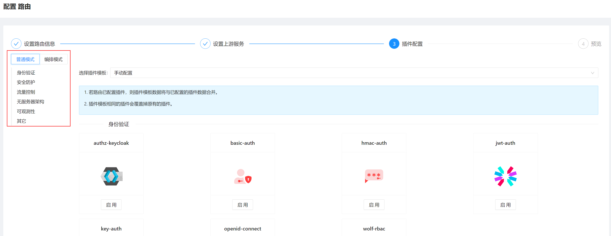


###  路由匹配补充

#### 匹配顺序

1.   首先，APISIX 会根据请求的 **HTTP 方法**（GET、POST、PUT 等）进行匹配。如果请求的方法与路由规则中指定的方法匹配，那么该路由规则将被视为匹配成功。
2.    其次，APISIX 会根据路由规则中的**路径进行匹配**。路径匹配是按照最长路径优先的原则进行的。如果请求的 URL 路径与路由规则中的路径匹配，那么该路由规则将被视为匹配成功。（**长路径匹配>优先级**）
3.    接下来，APISIX 可以根据需要进行**高级规则的匹配**。高级规则可以基于请求头、查询参数、请求体等进行匹配。你可以设置特定的规则来匹配请求中的特定内容。如果请求满足高级规则的匹配条件，那么该路由规则将被视为匹配成功。

 

PS：匹配条件的优先级只会影响匹配条件，即路径匹配部分：先按照最长路径匹配，如果有多个匹配，再选优先级高的。

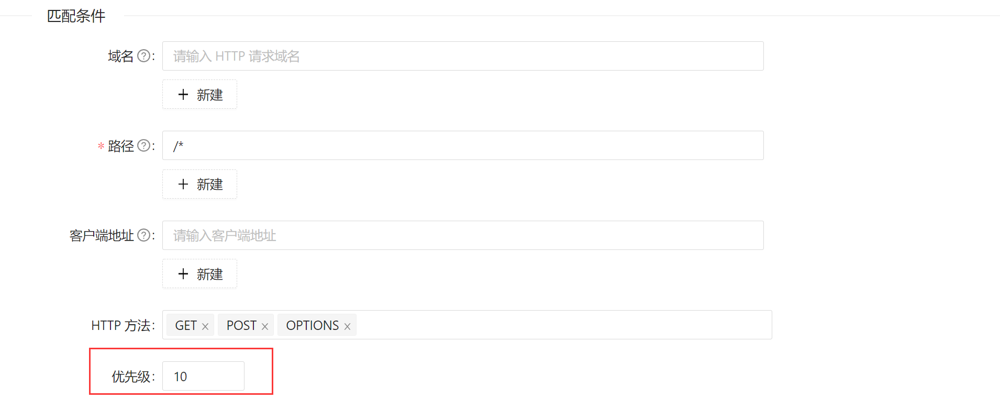

####  源码解析

> [APISIX源码分析——路由匹配](https://juejin.cn/post/6933768239008874510)


## 补充

### 七层流量vs四层流量

从负载均衡的角度出发，

**四层网络负载均衡是基于IP和端口做的转发**。通过虚拟的IP和端口接收到请求后，然后分配到真实的服务器，K8s中的endpoint就是基于四层网络负载均衡实现。

**七层网络负载均衡是基于URL等应用层信息作的转发**。通过虚拟的URL或者主机名接收到请求，然后在分配给真实的服务器。K8s中的ingress就是基于七层网络负载均衡实现。

本质上4 层负载均衡本质是转发，而 7 层负载本质是内容交换和代理。

 

### nginx vs openresty vs apisix

openresty是nginx做了一些封装和lua扩展后的静态的网关，

apisix本质上是openresty动态化，可以动态注册后端服务。

 

### 数据面与控制面


# 1.apisix的etcd存储


